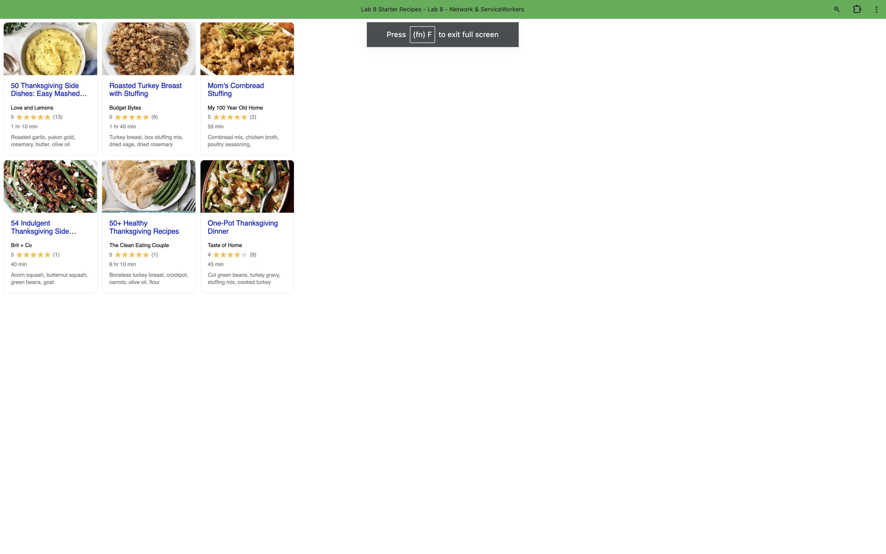

# Lab8-Starter

Site Link: 

In Wed Dev, Graceful Degradation is a strategy that ensures a website remains functional, even if some of the newer or advanced features are not supported by a user's browser or device. Service workers, which operate as a type of network proxy within a user's browser, are inherently related to this concept. They enhance the user experience by allowing websites to load and run faster, and more importantly, they enable functionality offline or in unstable network conditions.

Service workers achieve this by caching key resources, which allows a website to degrade gracefully when newer features reliant on network connectivity aren't available. For example, during a poor network connection, a service worker can serve cached content instead of attempting to fetch all resources from the network anew. This ensures that users still have access to critical functionality and content, preserving the core user experience, 

